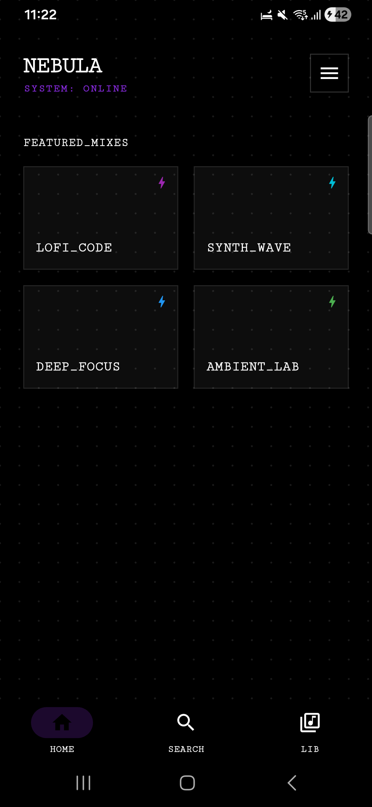
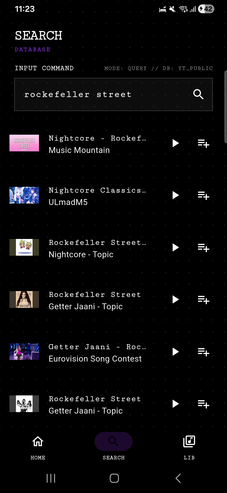
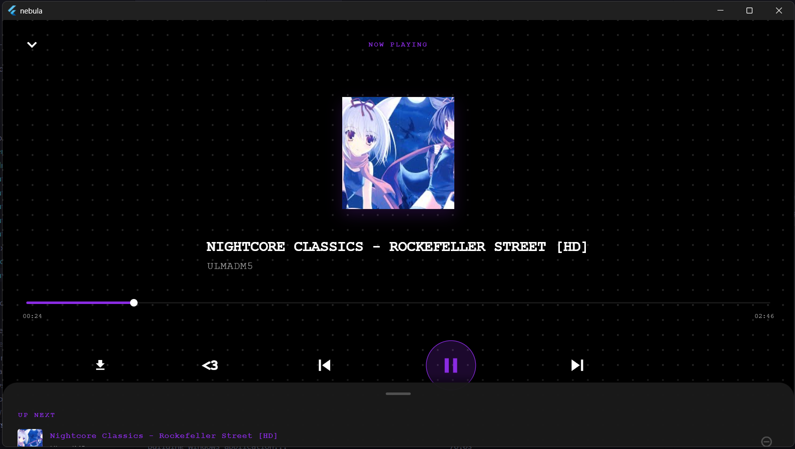
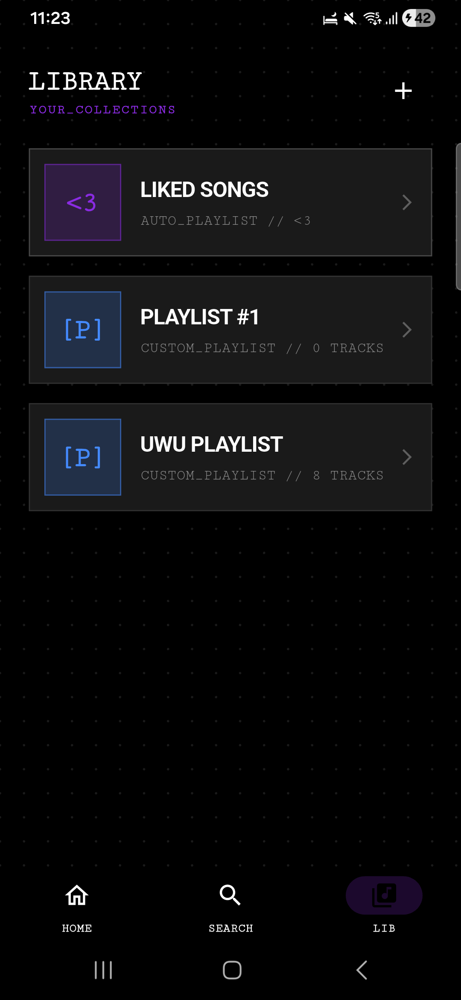
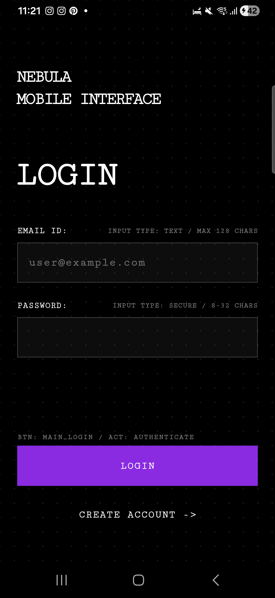
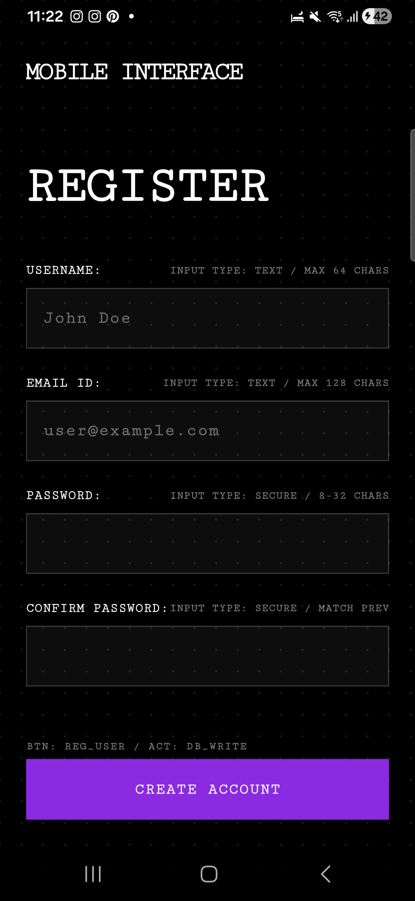
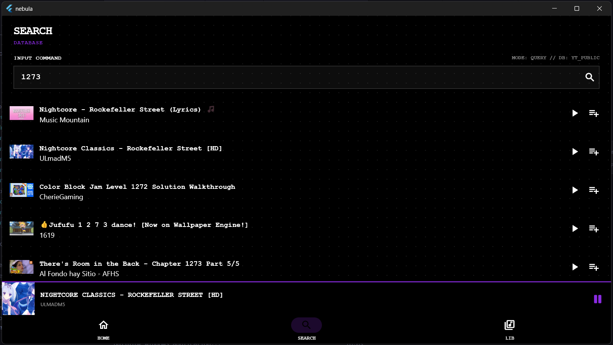

# Nebula 🌌

  

**Music. Open. Beautiful.**

Nebula is an open-source music streaming application designed for those who appreciate privacy and aesthetics as much as audio. Built with **Flutter** and **Supabase**, inspired by the industrial design language of CMF.

### Why Nebula?
*   **Zero Ads, Zero Cost:** Open source forever.
*   **Stunning UI:** Monochrome, dot-matrix typography, and fluid animations.
*   **Community Warning:** This isn't just an app; it's a movement against closed ecosystems.

---

### Screenshots

#### 🌌 Experience Nebula
A seamless music experience across devices.

  
  
  

 

<b>View All Authentic & Platform Screens</b>

 

**Mobile Interface**

  
  
  

**Desktop Interface**

  

---

### Getting Started
Want to run Nebula on your device or contribute to the code?
**[Check out our Wiki](https://github.com/TG12r/nebula/wiki/Setup)** for the full setup guide.

### Author
Built with love by **Tomás**.

---
*Stars are appreciated! ⭐*
